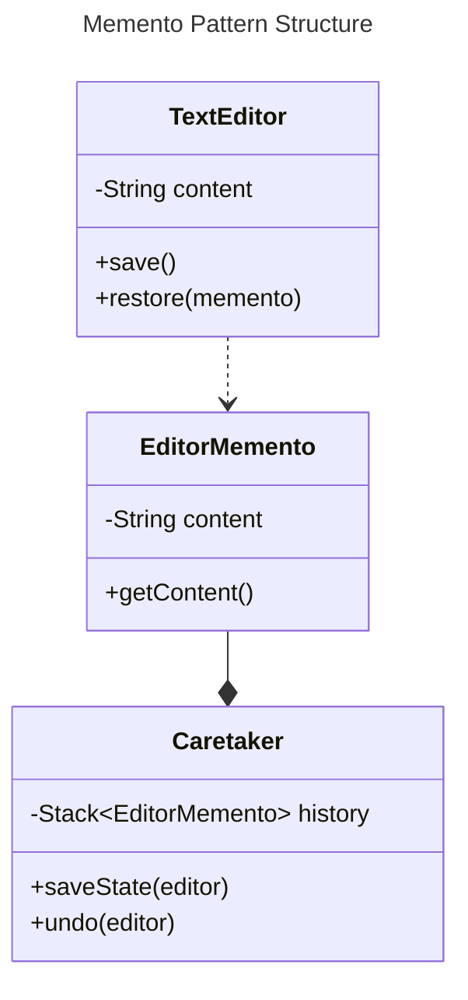
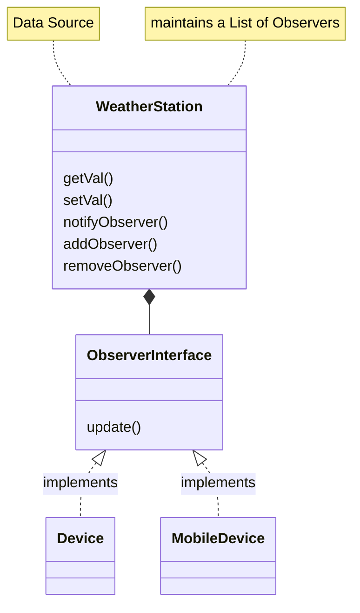
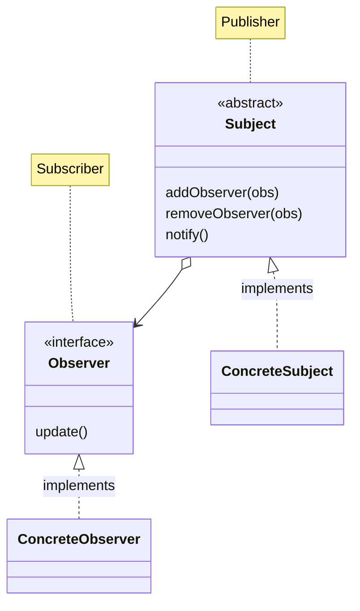
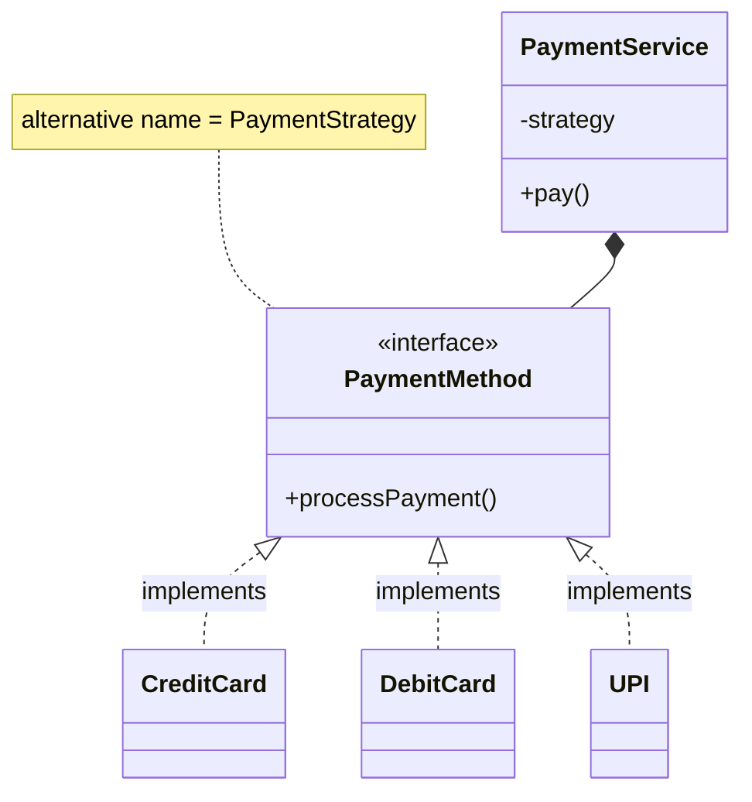
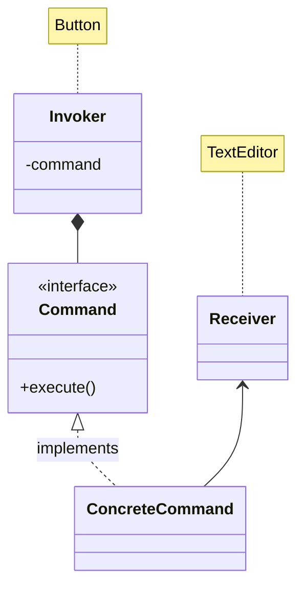
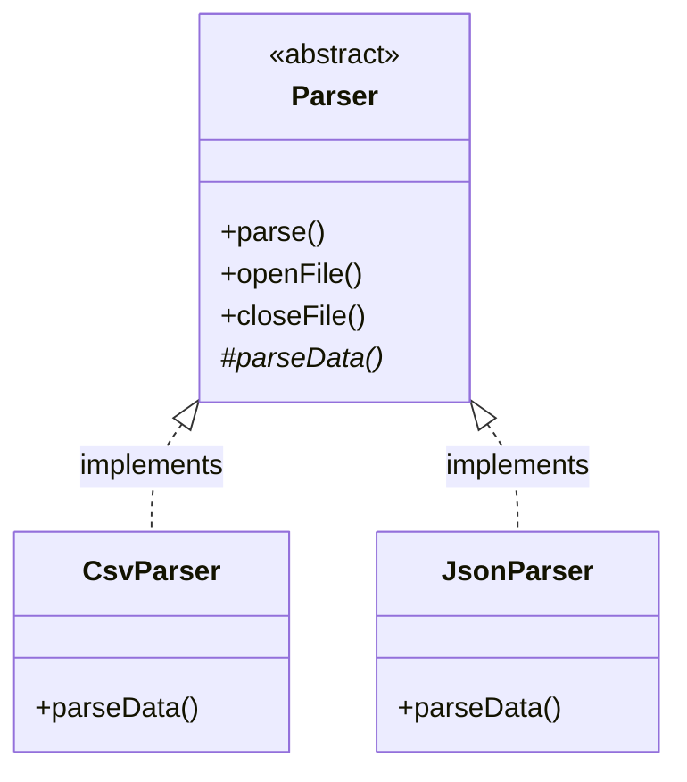

# Behavioral Patterns

Behavioral patterns focus on how **objects communicate** and interact, managing the flow of information between entities.

They simplify complex control flow by defining clear communication and behavior among objects.

They provide solutions for managing **object relationships** and **communication protocols** to promote **loose coupling** and enhance flexibility.

**Common Applications**
* Coordinating interactions between objects.
* Managing state transitions and communication efficiently


## Memento Pattern

**Problem**: How to provide **undo/redo functionality** or state restoration without
exposing the object's internal state and breaking encapsulation.

**Solution**: The Memento Pattern captures the internal state of an object in a
**memento**, allowing the object to restore its state later on without revealing internal
details.

### Memento Pattern Structure

**Components**
* **Originator**: The object whose state needs to be saved and restored. [TextEditor](../src/main/java/org/prateek/BehaviouralPatterns/MementoPattern/TextEditor.java)
* **Memento**: Captures and stores the internal state of the originator. [EditorMemento](../src/main/java/org/prateek/BehaviouralPatterns/MementoPattern/EditorMemento.java)
* **Caretaker**: Manages and stores the mementos, without modifying them. [Caretaker](../src/main/java/org/prateek/BehaviouralPatterns/MementoPattern/Caretaker.java)



### Memento Pattern Applications

**Undo/Redo in Applications**: Commonly used in text editors, drawing applications, or
any system that requires **history management**.

**State Restoration**: Used in scenarios where you need to periodically save system
states (e.g., games, data recovery) and allow users to return to previous states.

**Use Cases**:
* **Games**: Saving the game state for load/reload functionality.
* **Document Editors**: Undo/redo functionality to navigate through document
changes.

### Quiz

* The Memento Pattern is used to capture and restore an object's state without exposing its internal structure. This allows an object to return to a previous state.
* The Caretaker is responsible for storing and restoring the Memento without modifying it. The Caretaker does not know the internal structure of the Memento; it simply stores and retrieves it when necessary.
* The Memento Pattern respects encapsulation by allowing only the Originator to access and modify its internal state. The Caretaker and other classes have no knowledge of the Originator's state or structure.
* The Originator creates the Memento object because it knows the internal state that needs to be saved. The Caretaker simply stores the Memento for later use.
* A potential drawback of the Memento pattern is high memory usage if many states of an object are stored. This can be particularly problematic for applications that need to keep track of a large number of states over time.


## Observer Pattern

### Motivation

Suppose we have a weather station that records temperature and multiple devices
(e.g., display units) want to show the latest temperature. Without using the observer
pattern, the weather station would have to explicitly inform each device about the
temperature change, which results in tight coupling between the station and devices.

[ObserverPattern](../src/main/java/org/prateek/BehaviouralPatterns/ObserverPattern)

### Problems with Implementation

The `WeatherStation` class is tightly coupled to the `DisplayDevice` class.

If we need multiple devices (e.g., mobile, tablet) to display the temperature, we need
to modify the `WeatherStation` class, leading to poor scalability and flexibility.

### Observer Pattern

**Problem**: There is a need to notify multiple objects about a change in state without
tightly coupling them.

**Solution**: The Observer Pattern defines a **one-to-many dependency**. When one
object (the **Subject**) changes its state, all its dependents (the **Observers**) are notified
and updated automatically. This pattern is widely used for implementing distributed
event-handling systems, also known as the **publish-subscribe** pattern.



### Publisher Subscriber Pattern

Observer Pattern and Publisher Subscriber Pattern are basically the same. Only difference is that we have abstracted out `addObserver()`, `removeObserver`, and `notify()` to an Abstract Class.



* `Subject` could be either an **Abstract Class** or an **Interface**. Our implementation will use an interface because a **concrete class** inheriting from an **abstract class** can only have one parent (in Java).

### Observer Pattern Benefits

1. **Loose Coupling**: The subject (e.g., `WeatherStation`) doesn’t need to know
about the specific observers. It just notifies them.
2. **Scalability**: New observers (e.g., new display devices) can easily be added
without changing the subject.
3. **Flexibility**: Observers can be dynamically added or removed at runtime

### Observer Pattern Use Cases

* **Event Listeners**: GUI frameworks often use the Observer Pattern to
implement event listeners for handling button clicks, input changes, etc.
* **Stock Price Monitoring**: When a stock price changes, multiple subscribers
(like investors or systems) can be notified of the change.
* **News Publishing Systems**: News articles are published (subject), and
subscribers (users) are notified whenever a new article is available.
* **Social Media Notifications**: Users can subscribe to updates from specific
accounts, and when an account posts (subject), all followers (observers) are
notified.
* **Logging Systems**: Different logging handlers can observe events and log
them as needed, such as to the console, file, or remote server.

### Quiz

* The Observer Pattern enables an object (the subject) to maintain a list of dependents (observers) and automatically notify them of state changes, promoting a loose coupling between objects.
* The Observer Pattern is ideal for scenarios where one subject needs to notify multiple observers about changes, such as a weather station updating various display screens with new data.
* In the Observer Pattern, the Subject maintains a list of Observers and is responsible for notifying them of any changes in its state. 
* Allowing Observers to unregister themselves from the Subject helps manage memory and prevents memory leaks, ensuring that they do not receive notifications after they are no longer needed.
* The Observer pattern enables the Subject to notify Observers without knowing their specific implementations, promoting loose coupling and flexibility in the system.


## Strategy Pattern

### Motivation

Let's consider a simple payment system where users can pay using different methods like credit cards or PayPal. Without the Strategy Pattern, you might use `if-else` conditions to handle the different payment methods, leading to less maintainable and flexible code.

### Problems in Code

* The `PaymentService` class has multiple responsibilities (deciding the payment type and processing it).
* Adding a new payment method requires modifying the `PaymentService` class.
* The use of `if-else` conditions can make the code harder to maintain as more payment types are added.

**With the Strategy Pattern, the logic for each payment type is encapsulated in separate strategy classes, and the `PaymentService` (context class) delegates the task of payment processing to one of these strategies at runtime.**



### Strategy Pattern

**Problem**: Hardcoded algorithms in classes lead to:
* Code **duplication**.
* Increased **maintenance complexity** when switching between algorithms.
* **Violation of Open/Closed Principle**: Modifications are required every time a new algorithm is introduced.
**Solution**: The Strategy Pattern decouples the algorithm implementation from the client, allowing easy **switching of algorithms** without altering the client code.

### Strategy Pattern Structure

**Context**: The client class that uses a strategy to perform an operation.
**Strategy Interface**: Defines the operations that all concrete strategies must
implement.
**Concrete Strategy**: Implements the actual algorithms, interchangeable based on the
context.

### Strategy Pattern Use Case

**When to Use the Strategy Pattern**:
* When multiple algorithms need to be used interchangeably.
* To avoid conditional statements (`if-else` or `switch-case`) in the client
code.
* When a class has multiple behaviors, which can vary independently.

### Quiz

* The Strategy patten allows an object to change its behavior at runtime by selecting from different algorithms or strategies. This provides flexibility in choosing the best algorithm based on the context.
* The Strategy pattern is often used when different algorithms (e.g., sorting algorithms like quicksort or merge sort) need to be chosen at runtime based on the current state or data.
* The Strategy pattern improves flexibility by making algorithms or behaviors interchangeable. It allows changing the behavior of a class without modifying its source code, adhering to the Open/Closed Principle.
* In the Strategy Pattern, an interface is typically created to define the behavior or algorithm, and then concrete classes implement this interface, providing different strategies.
* The Strategy pattern adheres to the Open/Closed Principle by making it easy to add new strategies without modifying existing code.


## Command Pattern

### Motivation

Imagine you're developing a basic text editor with buttons for **bold**, **italic**, and **underline** text formatting.

Without the Command Pattern, the buttons directly interact with the `TextEditor` class, and you’d end up hardcoding behavior into the UI classes, making them tightly coupled.

### Problems in Code

* Each button class is tightly coupled with the `TextEditor`. If the action changes, all button classes need to be modified.
* It's harder to extend with new commands or add functionality such as undo/redo or logging.

### Command Pattern

By introducing the Command Pattern, we can **decouple** the actions (bold, italic, underline) from the UI components (buttons), making the design more flexible and maintainable. The buttons no longer need to know about the editor directly but instead work with generic `Command` objects.

### Command Pattern Structure

* **Structure**:
  * **Command**: Interface for executing operations.
  * **Invoker**: Sends the command.
  * **Receiver**: Performs the operation.



### Command Pattern Benefits

1. **Decoupling of Invoker and Receiver**: The button (invoker) doesn't know the details of the `TextEditor` (receiver), making the system more flexible and reusable.
2. **Command History and Undo**: Commands can be logged for undo/redo functionality.
   * To implement `undo()` functionality, add `undo()` to the `Command` interface
3. **Task Queuing**: Commands can be stored in a queue and executed later, making it useful for task scheduling.
4. **Extensibility**: New commands can be added easily without modifying existing code. For example, adding a `ChangeColorCommand` only requires creating a new command class.

### Command Pattern Use Cases

**GUI Applications**:
* Commands can be associated with buttons, menus, and keyboard shortcuts in applications like text editors, spreadsheets, or drawing software.

**Task Scheduling**:
* Commands can be placed in a queue and executed later, useful in batch processing or deferred task execution.

**Undo/Redo Functionality**:
* Commands can be stored and rolled back to provide undo and redo capabilities, especially in applications like IDEs, word processors, or graphics software.

**Macro Recording**:
* Actions performed by the user can be recorded as a series of commands, which can then be played back as macros.

### Command Pattern Drawbacks

* **Increased Complexity**: Introducing the Command Pattern can lead to more classes and complexity, especially when there are many different commands.
* **Overhead**: Each operation becomes an object, which may add memory and performance overhead in systems with large numbers of commands.

### Quiz

* The Command pattern encapsulates a request as an object, which allows clients to be parameterized with different requests, delayed execution, or queueing of operations.
* The Command pattern allows new commands to be introduced without modifying the Invoker or Client classes, adhering to the Open/Closed Principle.
* The Command interface typically includes an `undo()` method, allowing the system to reverse the operations performed by the execute method.
* A potential drawback of the Command pattern is the increase in the number of classes, as each command needs its own class. This can increase the complexity in systems with many different operations.
* A command pattern can be used to implement "Macro Commands as well". 
  * Macro commands allow users to perform a series of operations (commands) as one single command. This is often seen in applications where multiple actions need to be grouped together and executed as a unit. 
    * A video game where a "macro" can execute a series of character moves or an IDE that performs multiple code refactoring in one action.


## Template Method Pattern

### Motivation

Consider a scenario where you have different data parsers (e.g., CSV, XML, and JSON). Each parser follows the same steps: **open file, parse data, and close file**.

Without the Template Method Pattern, you might end up duplicating the common steps in each parser class.

### Problems in our code

* Code duplication: The `openFile()` and `closeFile()` methods are duplicated in both parsers.
* Any changes to the common logic would require changes in every parser, violating the DRY (Don’t Repeat Yourself) principle.



```java
class Parser {
    public void template() {
        openFile();
        parseData(); // specific parsing logic
        closeFile();
    }
}
```

### Template Method Pattern

**Problem**: Different parts of an algorithm may need to vary in subclasses, but the overall structure should remain consistent.

**Solution**: The Template Method Pattern defines the **skeleton** of an algorithm in a base class and lets subclasses override specific steps.

**Structure**:
* **Abstract Class**: Defines the algorithm skeleton.
* **Concrete Subclasses**: Override specific steps of the algorithm.

### Template Method Pattern Benefits

1. **Code Reuse**: Common code is moved to the parent class, promoting reuse
  and reducing duplication.
2. **Flexibility**: Subclasses can vary certain steps in the algorithm, while keeping
  the overall structure intact.
3. **Consistency**: Ensures that the high-level structure of the algorithm remains
  consistent, even when subclass behavior differs.

### Use Cases of Template Method

**UI Frameworks**: Rendering a UI element might follow a fixed set of steps (initialize, draw, finish), but the details of how each element is drawn are left to subclasses.

**Document Processing**: A framework might define the skeleton for reading, processing, and saving documents, while specific formats (e.g., Word, PDF) provide their own processing logic.

**Game Development**: A game loop (initialize, update, render) can be defined in a base class, with specific games implementing their own logic for updating and rendering.

The **Template Method Pattern** is ideal for situations where a common algorithm exists, but some steps may need to be redefined by subclasses. It helps enforce structure and promotes reusability, while allowing flexibility where needed.

### Quiz

* The purpose of the Template Method design pattern:
  * defines the skeleton of an algorithm in a base class
  * allows subclasses to override certain steps of the algorithm without changing its overall structure
  * allows subclasses to alter the structure of an algorithm without changing the algorithm's skeleton
* A "hook" is a method in the base class with a default or empty implementation that subclasses can override to extend or modify behavior.
* In the Template Method Pattern, the base class defines the overall structure or "template" of an algorithm, and some steps are delegated to subclasses to define.
* The Template Method Pattern adheres to the Open/Closed Principle because the algorithm's structure is defined in the base class, while subclasses can extend or modify specific steps without changing the overall template.
* The Template pattern is well-suited for report generation, where a common structure exists, but specific content and formatting vary across different report types.


## Iterator Pattern

### Motivation

Suppose you have a collection, such as an array or list, and you need to provide a mechanism for accessing its elements. Without the iterator pattern, the client code needs to understand how the collection is structured, and different collections would require different methods to traverse them.

### Problems in our code

**Problems**:
* The client needs to know the internal structure of the collection (array in this
case).
* If we change the collection type (e.g., from an array to a linked list), we would
need to modify the client code.
* It’s harder to implement different traversal strategies

### Iterator Pattern

**Problem**: How to access elements in a collection without exposing its internal representation.

**Solution**: The Iterator Pattern provides a way to **traverse** a collection without revealing its underlying structure, offering a uniform interface for traversal.

**Structure**:
* **Iterator**: Interface for traversing a collection.
* **Collection**: Holds the elements and provides an iterator.

### Iterator Pattern Benefits

1. **Separation of Concerns**: The traversal logic is separated from the collection
   itself, allowing you to change one without affecting the other.
2. **Uniform Interface**: The same interface (`Iterator`) is used to traverse
   different types of collections, making the code more flexible.
3. **Simplified Client Code**: The client doesn’t need to know the underlying data
   structure, reducing coupling and making the code easier to maintain.
4. **Multiple Traversal Strategies**: You can implement multiple types of iterators
   (e.g., forward, backward, filtered) without changing the collection.

### Iterator Pattern Use Cases

1. **Java Collections Framework**:
   * The Java Collections Framework (e.g., `ArrayList`, `HashSet`) uses the iterator pattern to provide a common interface (`Iterator`) for traversing different types of collections.
2. **Database Cursors**:
   * In database programming, cursors are used to iterate over result sets. The iterator pattern can abstract this traversal, making it easier to work with data from a database without exposing the underlying query mechanism.
3. **Tree Traversals**:
   * In tree data structures, the iterator pattern can be used to traverse nodes using different strategies like depth-first or breadth-first, without exposing the tree's internal structure.
4. **File Systems**:
   * File systems can use the iterator pattern to traverse directories and files without exposing the internal details of how files and folders are stored.

### Iterator Pattern Drawbacks

1. **Additional Complexity**: Implementing the iterator pattern can add extra layers of abstraction, especially for small or simple collections where direct traversal is sufficient.
2. **Increased Overhead**: For small collections or when the structure is unlikely to change, the overhead of creating iterators may not be justified.


## State Pattern

### Motivation

You are tasked with building a DirectionService class for a navigation app. This class calculates the estimated time of arrival (ETA) and provides directions between two points. The ETA and direction differ based on the mode of transportation, which can be one of the following:

* Walking
* Cycling
* Car
* Train

### Problems with our code

**Tight Coupling and Complex Conditional Logic**:
* The `DirectionService` likely uses conditional statements (`if-else` or `switch-case`) based on transportation mode enums to determine how to calculate ETA and provide directions.
* As the number of transportation modes increases, the conditional logic becomes **more complex and harder to maintain**.

**Violation of the Open/Closed Principle**:
* **Adding new transportation modes** (e.g., Airplane, Boat) requires modifying the existing`DirectionService` class, which goes against the **Open/Closed Principle** (classes should be open for extension but closed for modification).

**Code Duplication and Reduced Maintainability**:
* Similar code blocks for different transportation modes may lead to **code duplication**, making the system less maintainable and more error-prone.

**Scalability Issues**:
* As more features or transportation modes are added, the class becomes **bulky**, impacting scalability and readability

### State Pattern Structure

**Structure**:
* **Context**: Holds a reference to the current state.
* **State**: Interface for state-specific behavior.
* **Concrete State**: Specific implementations of the `State` interface that represent a particular state of the context object.

### State Pattern Example

**UI Navigation**
* **Scenario**: A mobile app UI where the navigation behavior changes based on
whether the user is logged in or not.

**Example**:
* States: **LoggedInState**, **LoggedOutState**.
* Context: The app's navigation system switches between these states.

### State Pattern Use Cases

1. **UI Components**: Buttons that change behavior based on state (enabled,
disabled, pressed).
2. **Vending Machines**: States like waiting for money, dispensing product, or out
   of stock.
3. **TCP Connections**: Changing behavior based on connection state (listening,
   connected, closed)


## Mediator Pattern

### Motivation

We want to build a chat system with multiple participants where each user can send messages to all other users. If users send messages to each other directly, the complexity increases as more users are added. Each user must know about every other user, creating a complex web of communication and dependencies.

### Problems with our code

* As more users are added, each user needs to manage direct communication with all others, leading to high coupling.
* If a new communication rule is introduced (e.g., message logging), it would need to be added to all users.

### Mediator Pattern

**Problem**: Objects in a system need to communicate, but direct communication leads to tight coupling and complexity.

**Solution**: The Mediator Pattern introduces a **mediator** object that handles all communication between objects, reducing direct dependencies and coupling.

In our chat app, by introducing a **Mediator** object, we will decouple the users from knowing about each other directly. The **Mediator** handles all communication, and the users (colleagues) only interact with the **Mediator**. This simplifies the interaction and reduces dependencies.

### Mediator Pattern Structure

1. **ChatMediator Interface**: Declares the `sendMessage` method, which all mediators must implement.
2. **Concrete Mediator**:
   * The `ChatRoom` class implements the `ChatMediator` interface. It holds a list of users and handles message broadcasting.
3. **User Class**:
   * Each `User` object represents a participant in the chat. When a user sends a message, the `sendMessage` method in the `ChatRoom` mediator is called, which distributes the message to all users except the sender.
4. **Communication**:
   * Users interact only with the `ChatRoom` (mediator), which facilitates communication between them, removing direct dependencies between individual users.

### Mediator Pattern Benefits

1. **Reduces Complexity**: The mediator centralizes communication, reducing direct dependencies between objects.
2. **Loose Coupling**: Colleagues only interact with the mediator, making them easier to manage, extend, and maintain.
3. **Single Responsibility**: The mediator handles complex communication logic, allowing colleagues to focus on their own behavior.
4. **Centralized Control**: Changes to communication rules can be made in the mediator without affecting the colleagues

### Mediator Pattern Use Cases

1. **Air Traffic Control**:
Airplanes communicate through a central control tower (mediator) instead of coordinating directly with each other. 
2. **GUI Component Coordination**:
In GUI applications, multiple UI components may need to interact. For example, when a dropdown changes, it may trigger updates to text fields, buttons, etc. A mediator can handle this interaction logic instead of having the components know about each other directly. 
3. **Workflow Systems**:
In a business process management system, a mediator can coordinate various activities across multiple systems or departments.


## Summary

This module covers key **Behavioral Design Patterns** that help define how objects interact and manage state transitions within a system. From **observer-based event notification** to **decoupling algorithms with strategies**, each pattern offers a solution to common communication challenges in software design.
