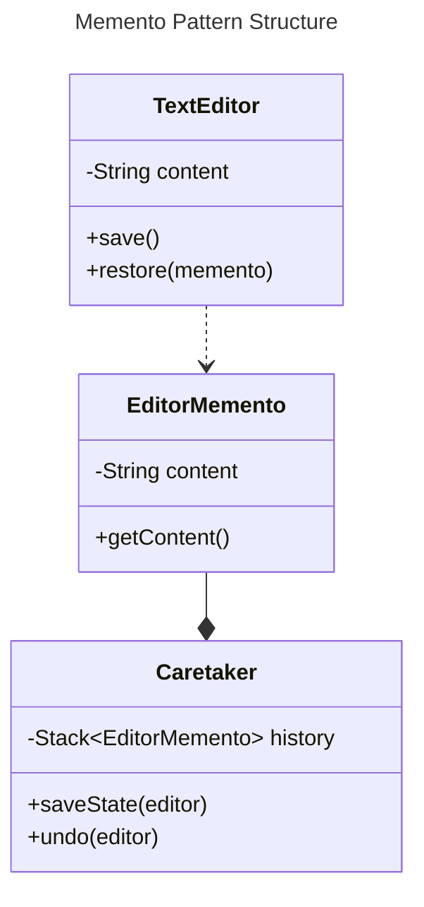
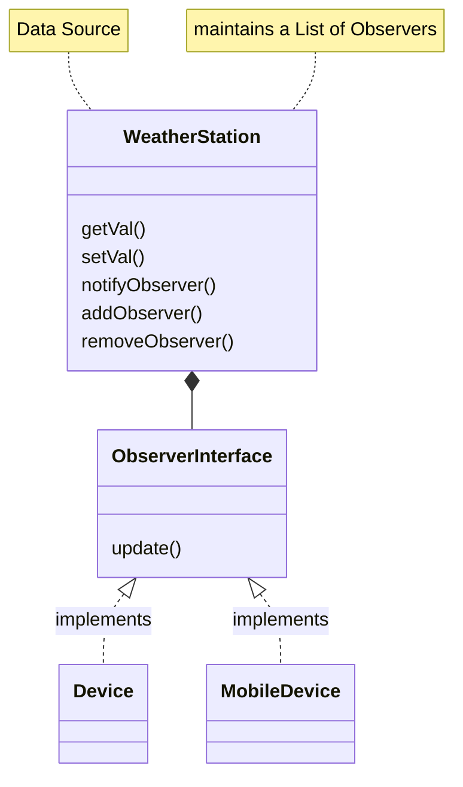
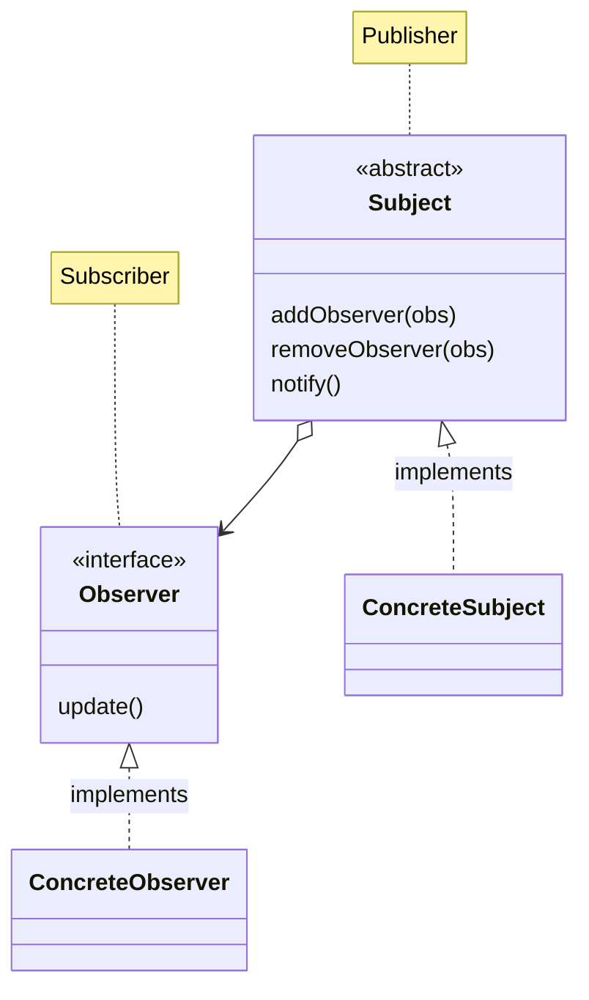

# Behavioral Patterns

Behavioral patterns focus on how **objects communicate** and interact, managing the flow of information between entities.

They simplify complex control flow by defining clear communication and behavior among objects.

They provide solutions for managing **object relationships** and **communication protocols** to promote **loose coupling** and enhance flexibility.

**Common Applications**
* Coordinating interactions between objects.
* Managing state transitions and communication efficiently

## Memento Pattern

**Problem**: How to provide **undo/redo functionality** or state restoration without
exposing the object's internal state and breaking encapsulation.

**Solution**: The Memento Pattern captures the internal state of an object in a
**memento**, allowing the object to restore its state later on without revealing internal
details.

### Memento Pattern Structure

**Components**
* **Originator**: The object whose state needs to be saved and restored. [TextEditor](../src/main/java/org/prateek/BehaviouralPatterns/MementoPattern/TextEditor.java)
* **Memento**: Captures and stores the internal state of the originator. [EditorMemento](../src/main/java/org/prateek/BehaviouralPatterns/MementoPattern/EditorMemento.java)
* **Caretaker**: Manages and stores the mementos, without modifying them. [Caretaker](../src/main/java/org/prateek/BehaviouralPatterns/MementoPattern/Caretaker.java)

### Memento Pattern Applications

**Undo/Redo in Applications**: Commonly used in text editors, drawing applications, or
any system that requires **history management**.

**State Restoration**: Used in scenarios where you need to periodically save system
states (e.g., games, data recovery) and allow users to return to previous states.

**Use Cases**:
* **Games**: Saving the game state for load/reload functionality.
* **Document Editors**: Undo/redo functionality to navigate through document
changes.

## Observer Pattern

### Motivation

Suppose we have a weather station that records temperature and multiple devices
(e.g., display units) want to show the latest temperature. Without using the observer
pattern, the weather station would have to explicitly inform each device about the
temperature change, which results in tight coupling between the station and devices.

[ObserverPattern](../src/main/java/org/prateek/BehaviouralPatterns/ObserverPattern)

### Problems with Implementation

The `WeatherStation` class is tightly coupled to the `DisplayDevice` class.

If we need multiple devices (e.g., mobile, tablet) to display the temperature, we need
to modify the `WeatherStation` class, leading to poor scalability and flexibility.

### Observer Pattern

**Problem**: There is a need to notify multiple objects about a change in state without
tightly coupling them.

**Solution**: The Observer Pattern defines a **one-to-many dependency**. When one
object (the **Subject**) changes its state, all its dependents (the **Observers**) are notified
and updated automatically. This pattern is widely used for implementing distributed
event-handling systems, also known as the **publish-subscribe** pattern.

### Publisher Subscriber Pattern

Observer Pattern and Publisher Subscriber Pattern are basically the same. Only difference is that we have abstracted out `addObserver()`, `removeObserver`, and `notify()` to an Abstract Class.

* `Subject` could be either an **Abstract Class** or an **Interface**. Our implementation will use an interface because a **concrete class** inheriting from an **abstract class** can only have one parent (in Java).

### Observer Pattern Benefits

* **Loose Coupling**: The subject (e.g., `WeatherStation`) doesn’t need to know
about the specific observers. It just notifies them.
* **Scalability**: New observers (e.g., new display devices) can easily be added
without changing the subject.
* **Flexibility**: Observers can be dynamically added or removed at runtime

### Observer Pattern Use Cases

* **Event Listeners**: GUI frameworks often use the Observer Pattern to
implement event listeners for handling button clicks, input changes, etc.
* **Stock Price Monitoring**: When a stock price changes, multiple subscribers
(like investors or systems) can be notified of the change.
* **News Publishing Systems**: News articles are published (subject), and
subscribers (users) are notified whenever a new article is available.
* **Social Media Notifications**: Users can subscribe to updates from specific
accounts, and when an account posts (subject), all followers (observers) are
notified.
* **Logging Systems**: Different logging handlers can observe events and log
them as needed, such as to the console, file, or remote server.

## Strategy Pattern
