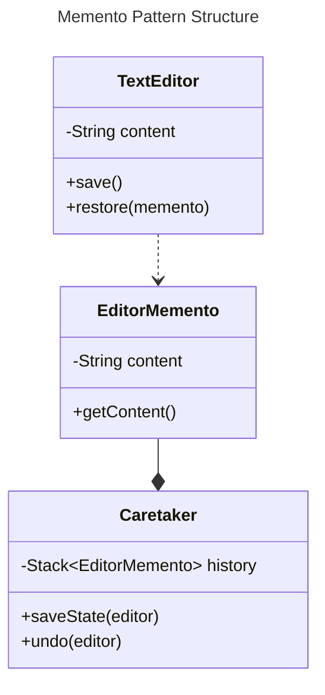

# Behavioral Patterns

Behavioral patterns focus on how **objects communicate** and interact, managing the flow of information between entities.

They simplify complex control flow by defining clear communication and behavior among objects.

They provide solutions for managing **object relationships** and **communication protocols** to promote **loose coupling** and enhance flexibility.

**Common Applications**
* Coordinating interactions between objects.
* Managing state transitions and communication efficiently

## Memento Pattern

**Problem**: How to provide **undo/redo functionality** or state restoration without
exposing the object's internal state and breaking encapsulation.

**Solution**: The Memento Pattern captures the internal state of an object in a
**memento**, allowing the object to restore its state later on without revealing internal
details.

### Memento Pattern Structure

**Components**
* **Originator**: The object whose state needs to be saved and restored. [TextEditor](../src/main/java/org/prateek/BehaviouralPatterns/MementoPattern/TextEditor.java)
* **Memento**: Captures and stores the internal state of the originator. [EditorMemento](../src/main/java/org/prateek/BehaviouralPatterns/MementoPattern/EditorMemento.java)
* **Caretaker**: Manages and stores the mementos, without modifying them. [Caretaker](../src/main/java/org/prateek/BehaviouralPatterns/MementoPattern/Caretaker.java)

### Memento Pattern Applications

**Undo/Redo in Applications**: Commonly used in text editors, drawing applications, or
any system that requires **history management**.

**State Restoration**: Used in scenarios where you need to periodically save system
states (e.g., games, data recovery) and allow users to return to previous states.

**Use Cases**:
* **Games**: Saving the game state for load/reload functionality.
* **Document Editors**: Undo/redo functionality to navigate through document
changes.
