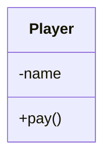
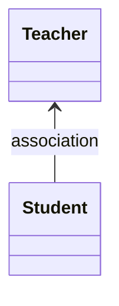
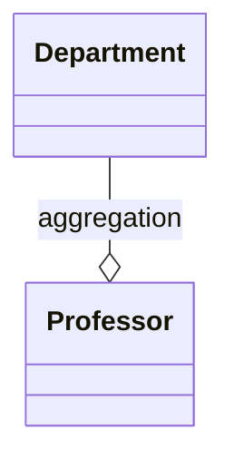
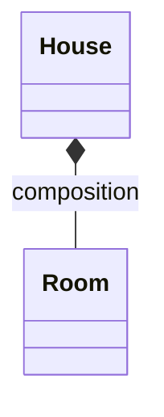
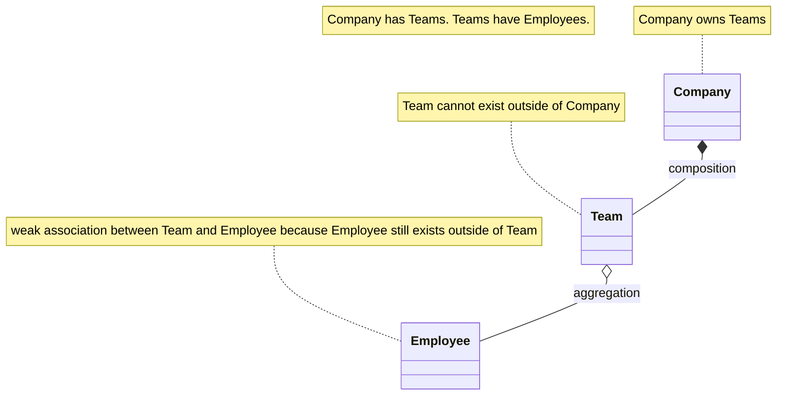
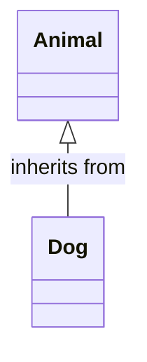
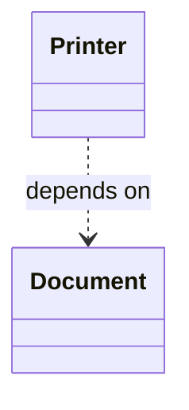
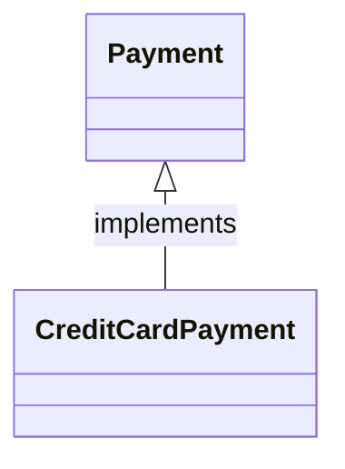

# Unified Modelling Language (UML)

## UML Diagrams

* Unified Modeling Language to model systems
* The idea is to have a uniform way to represent the classes, objects, relationships and interactions within simple or complex systems to make it easier for developers and stakeholders to understand and communicate about the system.

## UML Diagrams Importance

* **Visualization**: UML diagrams provide a visual representation of a system, making it easier to understand the structure, relationships, and interactions between components.
* **Documentation**: They serve as detailed documentation for the software architecture, which is useful for maintaining and scaling the system.
* **Communication**: UML diagrams are a common language for software designers, developers, and stakeholders, facilitating communication about the design.
* **Standardization**: Since UML is a standardized language, it ensures that everyone involved understands the system’s design in the same way

## Basic Elements

1. **Class**: A blueprint for objects, defined with a name, attributes, and methods.
   * Example: `class User { name, age, login() }`
2. **Interface**: A contract that defines methods that a class must implement.
   * Example: `interface Loginable { login() }`
3. **Object**: An instance of a class at runtime.
4. **Association**: A relationship between two classes that represents interactions between objects.
5. **Inheritance**: Represents an "is-a" relationship, where a subclass inherits from a superclass.
6. **Composition**: A stronger association where one object is part of another and cannot exist independently.
7. **Aggregation**: A weaker form of association where one object contains another, but they can exist independently


## Class Diagrams

**Class Diagram**: Represents the static structure of a system, showing classes, attributes, methods, and the relationships between them (inheritance, association, etc.).

```java
class Player {
    private String name;
    public void pay() {}
}
```



> By default, we can assume that all attributes are private and all methods are public.

## Association

**Association** represents a relationship between two or more classes. In this case, each object in one class is associated with one or more objects of another class.

[AssociationExample](../src/main/java/org/prateek/Basics/UML/AssociationExample.java)



## Aggregation

**Aggregation** is a weak "has-a" relationship where one class contains objects of another class. However, the contained objects can exist independently of the container object. 

[AggregationExample](../src/main/java/org/prateek/Basics/UML/AggregationExample.java)



## Composition

**Composition** is a strong "has-a" relationship, where one class owns objects of another class. If the container object is destroyed, the contained objects are destroyed as well. 

[CompositionExample](../src/main/java/org/prateek/Basics/UML/CompositionExample.java)



### Composition vs Aggregation



## Inheritance

**Inheritance** defines an "is-a" relationship where a subclass inherits properties and behaviors (methods) from a superclass.

[InheritanceExample](../src/main/java/org/prateek/Basics/UML/InheritanceExample.java)



## Dependency

This is a relationship where one class relies on another in some way, often through method parameters, return types, or temporary associations.

[DependencyExample](../src/main/java/org/prateek/Basics/UML/DependencyExample.java)



## Realization

A class implements the behavior defined by an interface.

[RealizationExample](../src/main/java/org/prateek/Basics/UML/RealizationExample.java)




## Summary

* **Association**: Objects are related but can exist independently.
* **Aggregation**: A weak "has-a" relationship where the contained objects can exist independently.
* **Composition**: A strong "has-a" relationship where the contained objects cannot exist without the container.
* **Inheritance**: A subclass inherits from a superclass (is-a relationship).
* **Dependency**: One class depends on another for its functionality.
* **Realization**: A class implements the behavior defined by an interface.
