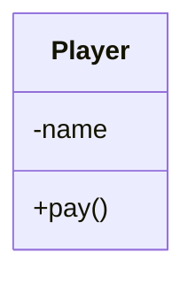
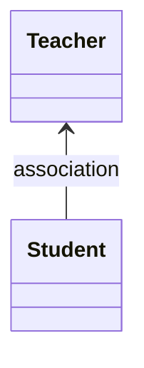
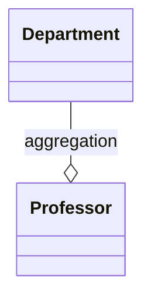
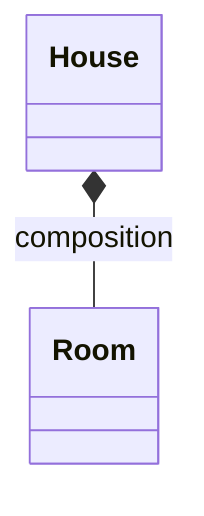
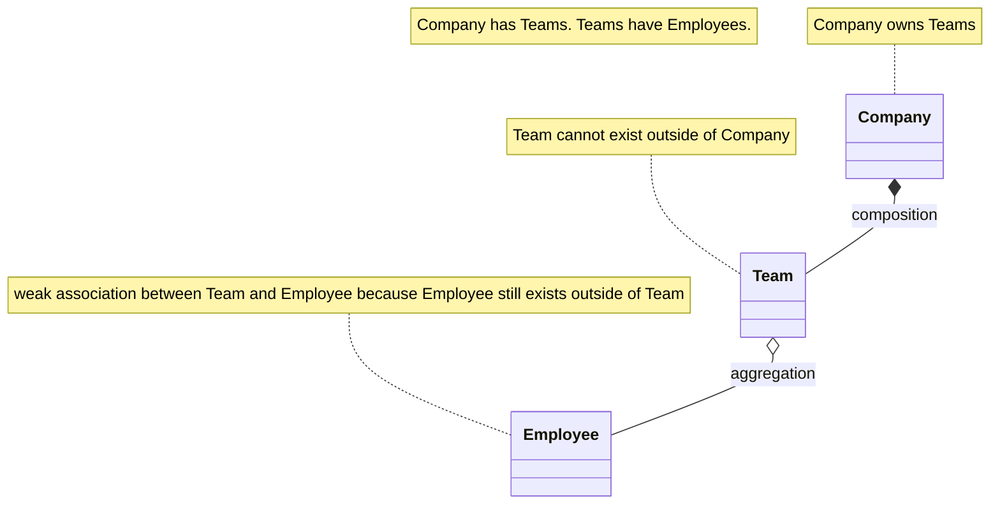
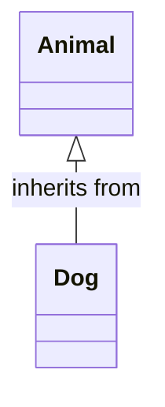
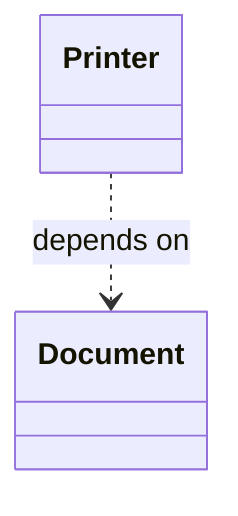
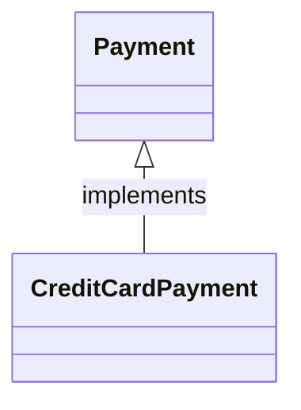

# Unified Modelling Language (UML)

## Class Diagrams

**Class Diagram**: Represents the static structure of a system, showing classes, attributes, methods, and the relationships between them (inheritance, association, etc.).

```java
class Player {
    private String name;
    public void pay() {}
}
```



> By default, we can assume that all attributes are private and all methods are public.

## Association

**Association** represents a relationship between two or more classes. In this case, each object in one class is associated with one or more objects of another class.

[AssociationExample](../src/main/java/org/prateek/Basics/UML/AssociationExample.java)



## Aggregation

**Aggregation** is a weak "has-a" relationship where one class contains objects of another class. However, the contained objects can exist independently of the container object. 

[AggregationExample](../src/main/java/org/prateek/Basics/UML/AggregationExample.java)



## Composition

**Composition** is a strong "has-a" relationship, where one class owns objects of another class. If the container object is destroyed, the contained objects are destroyed as well. 

[CompositionExample](../src/main/java/org/prateek/Basics/UML/CompositionExample.java)



### Composition vs Aggregation



## Inheritance

**Inheritance** defines an "is-a" relationship where a subclass inherits properties and behaviors (methods) from a superclass.

[InheritanceExample](../src/main/java/org/prateek/Basics/UML/InheritanceExample.java)



## Dependency

This is a relationship where one class relies on another in some way, often through method parameters, return types, or temporary associations.

[DependencyExample](../src/main/java/org/prateek/Basics/UML/DependencyExample.java)



## Realization

A class implements the behavior defined by an interface.

[RealizationExample](../src/main/java/org/prateek/Basics/UML/RealizationExample.java)



## Summary

* **Association**: Objects are related but can exist independently.
* **Aggregation**: A weak "has-a" relationship where the contained objects can exist independently.
* **Composition**: A strong "has-a" relationship where the contained objects cannot exist without the container.
* **Inheritance**: A subclass inherits from a superclass (is-a relationship).
* **Dependency**: One class depends on another for its functionality.
* **Realization**: A class implements the behavior defined by an interface.
